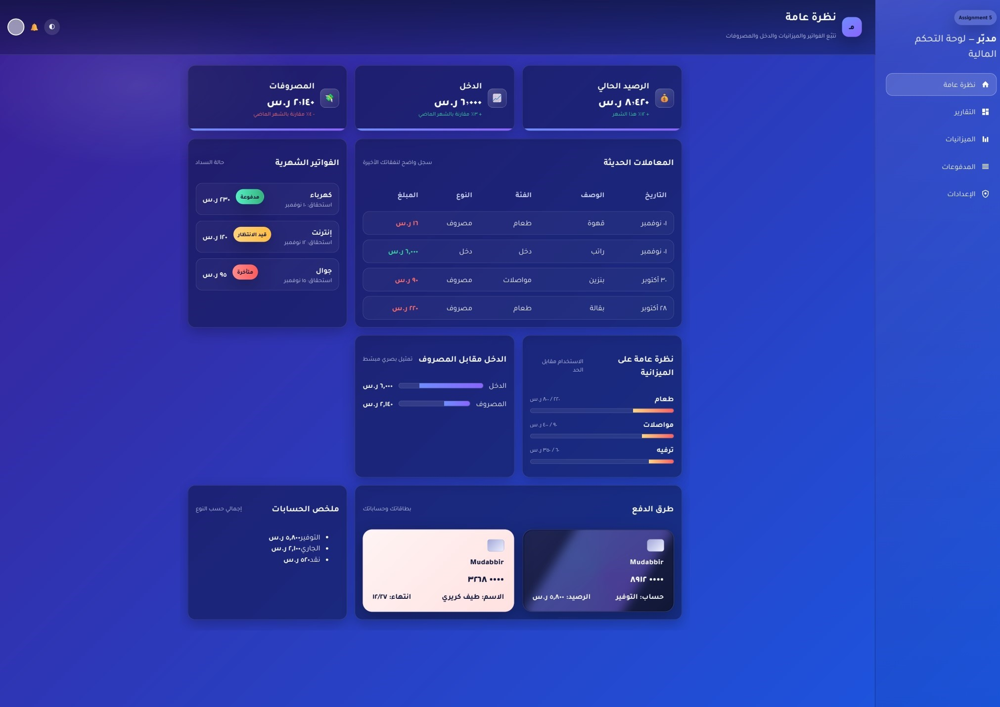

## Mudabbirr — Modern Arabic Financial Dashboard

Mudabbirr is a clean, modern, and fully handcrafted financial dashboard built entirely with HTML and CSS.
This project was created as an experimental UI concept to demonstrate the ability to design high-quality Arabic RTL dashboards with professional structure, organized layout, and strong visual hierarchy—without using JavaScript or external frameworks.

The goal of this project is to showcase precision in layout design, responsiveness, and UI composition while reflecting a premium software-as-a-service (SaaS) dashboard experience.

## Project Overview

Mudabbirr presents a complete financial snapshot through a structured and polished interface.
The dashboard includes:
 • KPI cards for balance, income, and expenses
 • A cleanly formatted table of recent transactions
 • Monthly bills with clear payment status indicators
 • Budget tracking represented with progress bars
 • A visual comparison of income versus expenses
 • A premium payment methods section featuring a glossy bank card
 • A summarized financial breakdown for quick insights

The design follows a practical and realistic dashboard layout similar to real financial systems and SaaS platforms.

## Project Preview

## Key Features

While Mudabbirr is currently a static, design-focused dashboard built with pure HTML and CSS, there are several planned enhancements that could elevate the dashboard into a fully functional financial system:
 ## • Dynamic Data Integration
Connecting the dashboard to real financial data using APIs or a backend service.
##  • User Authentication & Profiles
Implementing login and role-based access to personalize financial views.
##  • Interactive Charts & Visualizations
Adding live charts using libraries such as Chart.js or D3.js to display trends and insights more effectively.
##  • Transaction Management System
Allowing users to add, edit, or categorize expenses and income directly from the dashboard.
##  • Multi-Language Support
Expanding the interface beyond Arabic to support English and other languages with seamless switching.
##  • Theme Customization
Offering light/dark mode and customizable color palettes for better accessibility and user preference.
##  • Mobile App Version
Converting the dashboard into a mobile-friendly app experience using responsive design or frameworks like Flutter.

## Design Philosophy

The dashboard focuses on delivering a refined experience using CSS alone:
 • Glassmorphism for depth and elegance
 • Modern gradient styling
 • Balanced typography and spacing
 • A 12-column grid inspired by professional dashboard design
 • RTL-first layout tailored for Arabic environments
 • Smooth responsiveness optimized for 1366×768 laptop screens

The goal is to demonstrate that a premium interface can be built without relying on frameworks—only pure, well-structured CSS.

## Technologies Used

 • HTML5 for semantic, organized, and accessible structure
 • CSS3 for layout, grid, animations, and visual effects
 • Google Fonts (Tajawal) for clean Arabic typography
 • Git/GitHub for version control and project presentation

No JavaScript.
No Bootstrap or frameworks.
Just focused, handcrafted UI development.

## What This Project Demonstrates

 • Ability to build complete dashboard layouts from scratch
 
 • Strong skill in designing Arabic RTL interfaces with precision
 
 • Deep understanding of CSS Grid and Flexbox systems
 
 • Experience creating visually readable, scalable UI components
 
 • Professional project organization and Git workflow

Mudabbirr highlights both technical execution and aesthetic design, making it a strong addition to a UI-focused portfolio.

## Developer

Teef M. Karyry — TeefDev
